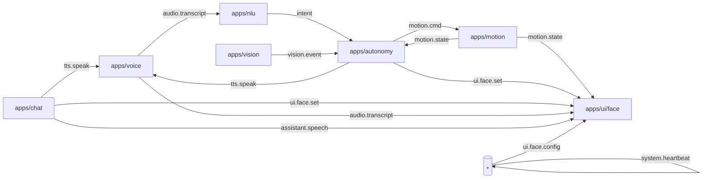

# Rider-Pi – Architektura projektu (draft v0.4)

> **Cel:** spójny opis architektury i kontraktów między modułami Rider-Pi (PUB/SUB na ZeroMQ), tak aby łatwo rozwijać autonomię, UI i sterowanie ruchem bez „tight coupling”.

Repo: `pppnews/Rider-Pi`\
Status: UI/Face po refaktorze (app + renderery), broker + narzędzia PUB/SUB, w trakcie – porządkowanie NLU/Motion/Voice.

---

## 1) Opis ogólny

Rider-Pi to modularny robot na Raspberry Pi. Każda funkcja działa jako oddzielna aplikacja w katalogu `apps/*` i komunikuje się przez prostą magistralę wiadomości (ZeroMQ PUB/SUB).\
Celem jest **interaktywny asystent-robot** z obsługą głosu, ruchu i percepcji (kamera), z lekkim UI na LCD („buźka”).

**Stan na teraz (UI):** interfejs „buźki” po refaktorze:

- `apps/ui/face.py` – logika aplikacji (BUS, model, pętla)
- `apps/ui/face_renderers.py` – renderery (LCD/Tk), brwi „tapered”, oversampling **AA×2**
- helper startowy w root: `./run_boot.sh` (**takeover → broker → face**; `--test` = krótka sekwencja mimiki)

---

## 2) Struktura katalogów

```
/apps
  /voice      – rozpoznawanie mowy; publikacja transkryptu na busie
  /nlu        – analiza języka naturalnego; mapowanie na intencje/komendy
  /motion     – sterowanie napędem (L298N/PWM), serwami; awaryjny STOP
  /autonomy   – logika autonomii i stany zachowań; decyzje
  /vision     – przetwarzanie obrazu (kamera), obserwacje dla autonomy
  /ui         – UI: face (LCD xgoscreen/Tk), PID-lock, SPI takeover, elipsa HEAD_KY
               • face.py            – app (BUS, model, pętla)
               • face_renderers.py  – rysowanie (LCD/Tk)
               • __init__.py
/common       – biblioteki wspólne (np. bus.py, utils)
/scripts      – narzędzia (broker i testowe pub/sub)
/systemd      – pliki jednostek usług (autostart – później)
/assets       – dźwięki/grafiki/animacje
/models       – lokalne modele (opcjonalnie)
/data
  /logs       – logi działania (ignorowane w git)
  /recordings – nagrania audio (ignorowane w git)

run_boot.sh   – szybki rozruch po restarcie (takeover → broker → face)
robot_dev.sh  – skrypt DEV (start/stop/status/all)
README.md     – skrót dla odwiedzających repo
PROJECT.md    – (ten plik) szczegóły architektury
```

> **Uwaga (spójność repo):** w repo istnieje `project.md` (lowercase). Proponujemy ujednolicić nazwę do `PROJECT.md`.

---

## 3) Architektura komunikacji (ZeroMQ)

**PUB/SUB**: każdy moduł publikuje i/lub subskrybuje wybrane tematy. Kontrakty poniżej.



### 3.1) Konwencje wiadomości (envelope + payload)

- **Czas**: pole `ts` = UNIX epoch (sekundy z ułamkiem, UTC). Jeśli wymagane opóźnienia/latencja → preferuj `ts_mono` (monotoniczny) dodatkowo.
- **Wersja kontraktu**: `ver` = semver modułu (np. `0.3.0`).
- **Idempotencja/śledzenie**: `msg_id` (UUIDv4) + opcjonalnie `corr_id` (korelacja zapytań/odpowiedzi).
- **Źródło**: `source` = nazwa aplikacji.

**Przykładowa koperta** *(rekomendowana, ale nie obowiązkowa)*:

```json
{
  "msg_id": "2f9c2b72-62a7-4b1a-bdc6-8c0e3d1aef22",
  "ts": 1724652345.123,
  "ver": "0.3.0",
  "source": "autonomy",
  "payload": { /* kontrakt tematu */ }
}
```

> Jeśli moduł wysyła „goły payload” (bez koperty) – **musi** zachować pola wymagane w tabeli tematów poniżej.

### 3.2) Tematy i minimalne ładunki (JSON)

| Topic              | Producent → Konsument      | Payload (minimal)                                                     |
| ------------------ | -------------------------- | --------------------------------------------------------------------- |
| `audio.transcript` | voice → nlu/chat/\*        | `{ "text":"jedź na przód", "lang":"pl", "ts":123, "source":"voice" }` |
| `tts.speak`        | chat/nlu → voice/ui        | `{ "text":"Jadę do przodu", "voice":"pl" }`                           |
| `assistant.speech` | chat → ui                  | `{ "viseme_seq":[[t,idx],...], "text":"..." }` *(opcjonalnie)*        |
| `motion.cmd`       | nlu/chat/autonomy → motion | `{ "type":"drive", "dir":"forward", "speed":0.6, "dur":1.0 }`         |
| `motion.state`     | motion → autonomy/ui/\*    | `{ "battery":0.82, "speed":0.0, "ts":123 }`                           |
| `vision.event`     | vision → autonomy/\*       | `{ "type":"obstacle", "dist_cm":23, "ts":123 }`                       |
| `ui.face.set`      | nlu/chat/autonomy → ui     | `{ "expr":"happy", "intensity":0.7, "blink":true }`                   |
| `ui.face.config`   | \* → ui                    | `{ "brow_style":"tapered", "quality":"aa2x", "brow_y_k":0.22 }`       |
| `system.heartbeat` | ui/voice/motion/\* → \*    | `{ "app":"ui.face", "pid":1234, "ver":"0.3.0", "fps":12.3 }`          |

**Subskrypcje UI (stan bieżący):**

- `ui.state`, `assistant.speech`, `audio.transcript` – sterują mrugnięciem/ustami/kolorem
- `ui.face.set` – ekspresje (`happy/neutral/wake/process/low_battery/speak`) + `intensity`, `blink`
- `ui.face.config` – runtime-konfiguracja wyglądu/trybu

---

## 4) Wymagania i środowisko

- Raspberry Pi OS / Linux
- Python ≥ 3.9
- Pakiety (min): `pyzmq`, `Pillow`, `xgoscreen` (LCD), `RPi.GPIO`/`gpiozero`
- (Opcjonalnie) `venv`

**Zmienne środowiskowe (wspólne):**

- Bus: `BUS_HOST=127.0.0.1`, `BUS_PUB=5555`, `BUS_SUB=5556`
- Locale: `LANG=pl`
- Logi: każdy moduł loguje do `data/logs/<mod>.log` (git-ignore)

**UI (FACE) – ENV:**

- `FACE_BACKEND`: `lcd | tk` (domyślnie `lcd`)
- `FACE_GUIDE`: `1/0` – elipsa przewodnik
- `FACE_HEAD_KY`: `0.90–1.20` – skala pionu elipsy (`1.00`=koło; `>1`=owal)
- `FACE_BENCH`: `1/0` – FPS/draw/push na STDOUT
- `FACE_LCD_ROTATE`: `0/90/180/270` (typowo `270` dla Rider-Pi)
- `FACE_BROW_STYLE`: `classic | tapered`
- `FACE_QUALITY`: `fast | aa2x`

---

## 5) Uruchamianie i runbook DEV

**A) Szybki start po restarcie (polecane):**

```bash
cd ~/robot
chmod +x run_boot.sh
./run_boot.sh --test   # takeover → broker → face; plus skrócona sekwencja mimiki
```

**B) Ręcznie, krok po kroku:**

```bash
# 1) broker
python3 scripts/broker.py

# 2) face (LCD)
FACE_BACKEND=lcd FACE_GUIDE=1 python3 -m apps.ui.face

# 3) test BUS (inne okno)
python3 scripts/pub.py ui.face.set    '{"expr":"neutral"}'
python3 scripts/pub.py ui.face.set    '{"expr":"happy","intensity":1,"blink":true}'
python3 scripts/pub.py ui.face.config '{"brow_style":"tapered","quality":"aa2x","brow_y_k":0.22,"mouth_y_k":0.205,"head_ky":1.04}'
```

**C) DEV kontroler (multi-moduł):**

```bash
# UI (wykonuje też takeover)
./robot_dev.sh face

# inne:
./robot_dev.sh broker | stop | status | all | takeover
```

**Kolejność startu (DEV):**

1. `broker`
2. `voice`
3. `nlu` i/lub `chat`
4. `motion`, `vision`
5. `ui` (LCD face)

> Na razie bez `systemd` – za to `run_boot.sh` i `robot_dev.sh`.

---

## 6) Kontrakty szczegółowe – NLU ⇄ Motion

### 6.1) Intencje NLU

Minimalny zestaw (PL):

- `move.forward` – jedź prosto (`jedź na przód`, `do przodu`)
- `move.backward` – jedź wstecz
- `turn.left` / `turn.right` – obrót w miejscu
- `arc.left` / `arc.right` – łuk (lekki skręt podczas jazdy)
- `stop` – awaryjne zatrzymanie
- `speed.up` / `speed.down` – zmiana prędkości domyślnej

**Payload (przykłady):**

```json
{"intent":"move.forward","speed":0.6,"dur":1.0}
{"intent":"turn.left","speed":0.4,"deg":45}
{"intent":"stop"}
```

### 6.2) `motion.cmd` – taksonomia komend

| type    | Pola wymagane     | Opis                                    |                                                 |
| ------- | ----------------- | --------------------------------------- | ----------------------------------------------- |
| `drive` | \`dir: forward    | backward`, `speed: 0.0–1.0`, `dur: s?\` | Jazda liniowa przez czas `dur` lub do odwołania |
| `spin`  | \`dir: left       | right`, `speed`, `deg?: 0–360\`         | Obrót w miejscu                                 |
| `arc`   | \`dir: left       | right`, `speed`, `radius\_cm`, `dur?\`  | Łuk o promieniu                                 |
| `servo` | `id`, `angle_deg` | Ustawienie serwa (głowa/kamera)         |                                                 |
| `stop`  | —                 | Natychmiastowy STOP                     |                                                 |

**Jednostki**: `speed` w [0..1] (skala PWM), dystanse w cm, kąty w stopniach.

### 6.3) `motion.state` – telemetria minimalna

```json
{
  "battery": 0.82,
  "speed": 0.0,
  "motors": {"L": 0.00, "R": 0.00},
  "ts": 1724652345.321
}
```

---

## 7) Vision ⇄ Autonomy

- `vision.event` typy wstępne: `obstacle`, `line`, `face`, `marker`
- Przykład: `{ "type":"obstacle", "dist_cm":23, "ts":... }`

---

## 8) UI (LCD Face) – szczegóły

- Obwiednia głowy jako **elipsa** sterowana `HEAD_KY`; brwi „tapered” (poligon, opcjonalny AA×2).
- Parametry mimiki (usta/brwi) skalowane względem wymiaru kanwy — spójnie LCD/Tk.
- `ui.face.config` – runtime (pozycja brwi/ust, styl brwi, jakość, SPI Hz).
- PID-lock, SPI takeover, auto-reinit (LCD), możliwość **GUIDE** (elipsa pomocnicza).

---

## 9) Bezpieczeństwo i niezawodność

- **E-STOP**: komenda `motion.cmd {"type":"stop"}` + lokalny watchdog w `apps/motion` (np. brak `motion.cmd` > 1.5 s ⇒ stop PWM).
- **Watchdog BUS**: `system.heartbeat` co 1 s z każdego modułu; brak 3× ⇒ degradacja (np. UI pokazuje `low_battery`/`sad`).
- **Low battery**: `motion.state.battery < 0.15` ⇒ wymuszone `ui.face.set {expr:"low_battery"}` i ograniczenie prędkości.
- **Fencing GPIO**: jedyny proces posiadający kontrolę nad PWM/serwami (PID-lock) – unikanie konfliktów.

---

## 10) Logowanie i metryki

- Pliki: `data/logs/<mod>.log`
- UI (opcjonalnie): `FACE_BENCH=1` → FPS/draw/push na STDOUT
- Minimalny zestaw metryk: FPS UI, opóźnienia BUS (`ts`→`now`), licznik wiadomości, czas rysowania (ms)

---

## 11) Testy i narzędzia

**Sondowanie BUS:**

```bash
python3 scripts/sub.py "ui.face.*"
python3 scripts/sub.py motion.state
```

**Wysyłanie próbne:**

```bash
python3 scripts/pub.py audio.transcript '{"text":"jedź na przód","lang":"pl","ts":123,"source":"test"}'
python3 scripts/pub.py motion.cmd      '{"type":"drive","dir":"forward","speed":0.5,"dur":1.2}'
```

---

## 12) Sprzęt (skrót – do uzupełnienia)

- **Napęd**: L298N (L/R enable + PWM). *Mapę pinów GPIO dodać po stabilizacji okablowania.*
- **LCD**: 2" Rider-Pi, SPI, `FACE_LCD_ROTATE=270` (typowo).
- **Czujniki**: planowane – VL53L0X, linia, ultradźwięk (HC-SR04) – kontrakty będą publikować `vision.event`.

---

## 13) Roadmap / Sprinty (skrót)

**UI/Face (done, sprint S-UI-03):**

- Refaktor: **app + renderery**; import jako moduł: `python3 -m apps.ui.face`.
- Elipsa **HEAD\_KY**, brwi „tapered” (AA×2), skalowanie względne LCD/Tk.
- `ui.face.config` – runtime (pozycje, styl, jakość, SPI Hz).
- `run_boot.sh` – „jednostrzałowy” start po restarcie.

**NLU/Motion (S-MOVE-01, w


---

## 16) Menu, Przyciski i Launcher (MVP)

**Nowe moduły:**
- `apps/ui/buttons.py` — 4 przyciski → `ui.button` (`LEFT|RIGHT|OK|BACK` + `down|up|long`).
- `apps/menu/main.py` — proste menu stanów; sub `ui.button`, pub `system.mode`, `system.menu.state`, oraz na nawigacji wysyła `motion.cmd {"type":"stop"}` jako kill-switch.
- `apps/launcher/main.py` — menedżer trybów; sub `system.mode`, start/stop procesów dem/autonomii.
- `apps/demos/trajectory.py` — demo: drive→spin→drive→stop (do testów E2E).

**Tematy (kontrakt):**
- `ui.button` → `{ "id":"LEFT|RIGHT|OK|BACK", "event":"down|up|long", "ts":... }`
- `system.menu.state` → `{ "screen":"home", "cursor":0..N, "items":[...], "battery":0..1, "ts":... }`
- `system.mode` → `{ "mode":"teleop|demos|autonomy|settings", "demo?":"trajectory|...", "ts":... }`

**Zachowanie:**
- Home: `Dema • Autonomia • Teleop • Ustawienia • Logi` (nawigacja ←/→, OK=wejście, BACK=STOP/wyjście).
- Wejście w tryb zawsze poprzedza `STOP` (`motion.cmd {"type":"stop"}`) dla bezpieczeństwa.
- Blokada startu Dem/Autonomii przy `battery < 0.15`.

**Uwaga (SIM):** w trybie symulacji `BUTTONS_SIM=1` klawisze: strzałki / `h,l` / Enter/Spacja/`e` / Backspace/`b`. Wielkie litery `H/L/E/B` emitują `long`.

---

## 17) Procedura testowa (E2E)

### A) Na sucho (bez fizycznego ruchu)
```bash
# 1) broker
./robot_dev.sh broker

# 2) motion – symulacja (bez jechania)
MOTION_ENABLE=0 python3 -m apps.motion.main

# 3) przyciski (symulacja)
BUTTONS_SIM=1 python3 -m apps.ui.buttons

# 4) menu + launcher
python3 -m apps.menu.main
python3 -m apps.launcher.main

# 5) podgląd (w osobnych oknach)
python3 scripts/sub.py system.menu.state
python3 scripts/sub.py system.mode
python3 scripts/sub.py motion.state
```
**Akcja:** ustaw kursorem `Dema` (cursor=0) → naciśnij **OK**. Powinno polecieć `system.mode {"mode":"demos","demo":"trajectory"}`, a w `motion.state` zobaczysz sekwencję (periodyki, potem chwilowo `speed>0`, na końcu `reason:"dur_done"`).

### B) Fizycznie (świadomie)
```bash
./robot_dev.sh broker
MOTION_ENABLE=1 python3 -m apps.motion.main
python3 -m apps.ui.buttons
python3 -m apps.menu.main
python3 -m apps.launcher.main
```
Zapewnij przestrzeń. **Kill‑switch** zawsze działa:
```bash
python3 scripts/pub.py motion.cmd '{"type":"stop"}'
```

### C) Troubleshooting
- Nic się nie uruchamia → sprawdź, czy `apps.launcher.main` działa (log *Launcher: mode=...*), oraz czy w `system.mode` jest `{"mode":"demos","demo":"trajectory"}`.
- Widzisz tylko `system.menu.state` → nie wcisnąłeś **OK** na „Dema”.
- „Dema” zablokowane → `battery < 0.15`.

---

## 18) Roadmapa operacyjna (plan testów 0→5)

**0. Zabezpieczenia (BHP)** — watchdog `strict`, globalny `stop`, blokady przy niskiej baterii, `MOTION_ENABLE` domyślnie `0`.

**1. Pierwszy ruch** — fizyczny test `drive/spin/stop` przez `motion.cmd`.

**2. Przyciski** — `apps/ui/buttons.py` (GPIO/SIM) + podgląd `ui.button`.

**3. Menu (bez LCD UI)** — `apps/menu.main` + `system.menu.state`.

**4. Tryb DEMO** — wybór „Dema” → launcher odpala `apps.demos.trajectory`.

**5. Powrót do głosu** — `system.mode: teleop` i test NLU → `motion.cmd`.

Następne: dodać dema **Postura** (`motion.cmd: posture`) i **Poses** (`motion.cmd: action`), potem pełną autonomię (FSM) i UI‑overlay.

