# Rider-Pi – Architektura projektu (v0.4.2)

> **Cel:** spójny opis architektury i kontraktów między modułami Rider‑Pi (PUB/SUB na ZeroMQ), tak aby łatwo rozwijać autonomię, UI i sterowanie ruchem bez tight coupling.

Repo: `pppnews/Rider-Pi`\
Status: UI/Face po refaktorze (app + renderery), broker + narzędzia PUB/SUB; **Motion**: pętla nieblokująca + watchdog (*strict/lease*), telemetria `motion.state`; **UI**: mostek `apps/ui/tts2face.py` (mapuje `tts.speak` → `ui.face.set`); **NLU v0.1**: reguły PL → `motion.cmd`.

---

## 1) Opis ogólny

Rider‑Pi to modularny robot na Raspberry Pi. Każda funkcja działa jako oddzielna aplikacja w katalogu `apps/*` i komunikuje się przez prostą magistralę wiadomości (ZeroMQ PUB/SUB).\
Celem jest **interaktywny asystent‑robot** z obsługą głosu, ruchu i percepcji (kamera), z lekkim UI na LCD („buźka”).

**Stan na teraz (UI):** interfejs „buźki” po refaktorze:

- `apps/ui/face.py` – logika aplikacji (BUS, model, pętla)
- `apps/ui/face_renderers.py` – renderery (LCD/Tk), brwi „tapered”, oversampling **AA×2**
- helper startowy w root: `./run_boot.sh` (**takeover → broker → face**, `--test` = krótka sekwencja mimiki)

---

## 2) Struktura katalogów

```
/apps
  /voice      – rozpoznawanie mowy; publikacja transkryptu na busie
  /nlu        – analiza języka naturalnego; mapowanie na intencje/komendy
  /motion     – sterowanie napędem (L298N/PWM), serwami; awaryjny STOP
  /autonomy   – logika autonomii i stany zachowań; decyzje
  /vision     – przetwarzanie obrazu (kamera), obserwacje dla autonomy
  /ui         – UI: face (LCD xgoscreen/Tk), PID-lock, SPI takeover, elipsa HEAD_KY
               • face.py            – app (BUS, model, pętla)
               • face_renderers.py  – rysowanie (LCD/Tk)
               • __init__.py
               • tts2face.py        – mostek `tts.speak` → `ui.face.set` (auto powrót do `neutral`)
/common       – biblioteki wspólne (np. bus.py, utils)
/scripts      – narzędzia (broker i testowe pub/sub)
/systemd      – pliki jednostek usług (autostart – później)
/assets       – dźwięki/grafiki/animacje
/models       – lokalne modele (opcjonalnie)
/data
  /logs       – logi działania (ignorowane w git)
  /recordings – nagrania audio (ignorowane w git)

run_boot.sh   – szybki rozruch po restarcie (takeover → broker → face)
robot_dev.sh  – skrypt DEV (start/stop/status; cele: broker, face, motion, nlu, tts2face)
README.md     – skrót dla odwiedzających repo
PROJECT.md    – (ten plik) szczegóły architektury
```

---

## 3) Architektura komunikacji (ZeroMQ)

**PUB/SUB**: każdy moduł publikuje i/lub subskrybuje wybrane tematy. Kontrakty poniżej.

```mermaid
flowchart LR
  Voice[apps/voice] -->|audio.transcript| NLU[apps/nlu]
  NLU -->|intent| Autonomy[apps/autonomy]
  Vision[apps/vision] -->|vision.event| Autonomy
  Autonomy -->|motion.cmd| Motion[apps/motion]
  Motion -->|motion.state| Autonomy
  Motion -->|motion.state| UI[apps/ui/face]
  Autonomy -->|tts.speak| Voice
  Chat[apps/chat] -->|tts.speak| Voice
  %% Mostek TTS→Face (UI):
  Chat -->|tts.speak| TTS2Face[apps/ui/tts2face]
  Autonomy -->|tts.speak| TTS2Face
  TTS2Face -->|ui.face.set| UI
  Autonomy -->|ui.face.set| UI
  Chat -->|ui.face.set| UI
  Voice -->|audio.transcript| UI
  Chat -->|assistant.speech| UI
  Any[(*)] -->|ui.face.config| UI
  Any -->|system.heartbeat| Any
```



### 3.1) Konwencje wiadomości (envelope + payload)

- **Czas**: `ts` = UNIX epoch (s z ułamkiem, UTC). Dopuszczalne dodatkowo `ts_mono` (monotoniczny) dla precyzji opóźnień.
- **Wersja kontraktu**: `ver` = semver modułu (np. `0.3.0`).
- **Idempotencja/śledzenie**: `msg_id` (UUIDv4) + opcjonalnie `corr_id`.
- **Źródło**: `source` = nazwa aplikacji.

**Przykładowa koperta** *(rekomendowana, ale nie obowiązkowa)*:

```json
{
  "msg_id": "2f9c2b72-62a7-4b1a-bdc6-8c0e3d1aef22",
  "ts": 1724652345.123,
  "ver": "0.3.0",
  "source": "autonomy",
  "payload": { /* kontrakt tematu */ }
}
```

> Jeśli moduł wysyła „goły payload” (bez koperty) – **musi** zachować pola wymagane w tabeli tematów poniżej.

### 3.2) Tematy i minimalne ładunki (JSON)

| Topic              | Producent → Konsument      | Payload (minimal)                                                      |           |                                     |
| ------------------ | -------------------------- | ---------------------------------------------------------------------- | --------- | ----------------------------------- |
| `audio.transcript` | voice → nlu/chat/\*        | `{ "text":"jedź naprzód", "lang":"pl", "ts":123, "source":"voice" }`   |           |                                     |
| `tts.speak`        | chat/nlu → voice/ui        | `{ "text":"Jadę do przodu", "voice":"pl" }` *(UI przez mostek **``**)* |           |                                     |
| `assistant.speech` | chat → ui                  | \`{ "event":"start                                                     | viseme    | end", ... }\` *(jeśli obsługiwane)* |
| `motion.cmd`       | nlu/chat/autonomy → motion | `{ "type":"drive", "dir":"forward", "speed":0.6, "dur":1.0 }`          |           |                                     |
| `motion.state`     | motion → autonomy/ui/\*    | \`{ "speed":0.0, "ts":123, "reason":"periodic                          | dur\_done | watchdog", "wd"\:true }\`           |
| `vision.event`     | vision → autonomy/\*       | `{ "type":"obstacle", "dist_cm":23, "ts":123 }`                        |           |                                     |
| `ui.face.set`      | nlu/chat/autonomy → ui     | `{ "expr":"happy", "intensity":0.7, "blink":true }`                    |           |                                     |
| `ui.face.config`   | \* → ui                    | `{ "brow_style":"tapered", "quality":"aa2x", "brow_y_k":0.22 }`        |           |                                     |
| `system.heartbeat` | ui/voice/motion/\* → \*    | `{ "app":"ui.face", "pid":1234, "ver":"0.3.0", "fps":12.3 }`           |           |                                     |

**Subskrypcje UI (stan bieżący):**

- `ui.state`, `assistant.speech`, `audio.transcript` – sterują mrugnięciem/ustami/kolorem
- `tts.speak` (pośrednio przez `apps/ui/tts2face`) – ekspresja „speak” na czas wypowiedzi
- `ui.face.set` – ekspresje (`happy/neutral/wake/process/low_battery/speak`) + `intensity`, `blink`
- `ui.face.config` – runtime‑konfiguracja wyglądu/trybu

``** – pola:**

- `expr`: `"neutral" | "happy" | "wake" | "record" | "process" | "speak" | "low_battery"`
- `intensity`: `0.0–1.0` (np. siła uśmiechu)
- `blink`: `true/false` (natychmiastowe mrugnięcie)

``** – pola (wybrane):**

- `brow_style`: `"classic" | "tapered"`
- `quality`: `"fast" | "aa2x"`
- `brow_taper`: `0.0–1.0` (zwężanie końcówek brwi)
- `brow_y_k`: `0.14–0.30` (pozycja brwi w górę/dół)
- `brow_h_k`: `0.06–0.16` (łuk/wygięcie brwi)
- `mouth_y_k`: `0.18–0.28` (pozycja ust)
- `head_ky`: `0.90–1.20` (elipsa głowy; `1.0` = koło)
- `lcd_spi_hz`: np. `48000000` (ustawiany w locie, jeśli sterownik pozwala)

> **Zgodność wstecz (tymczasowa):** `apps/motion` nasłuchuje dodatkowo aliasu `intent.motion` (stary temat); docelowo zostanie wyłączony na rzecz kanonicznego `motion.cmd`.

---

## 4) Wymagania i środowisko

- Raspberry Pi OS / Linux
- Python ≥ 3.9
- Pakiety (min): `pyzmq`, `Pillow`, `xgoscreen` (LCD), `RPi.GPIO`/`gpiozero`
- (Opcjonalnie) `venv`

**Zmienne środowiskowe (wspólne):**

- Bus: `BUS_HOST=127.0.0.1`, `BUS_PUB=5555`, `BUS_SUB=5556`
- Locale: `LANG=pl`
- Logi: każdy moduł loguje do `data/logs/<mod>.log` (git‑ignore)

**UI (FACE) – ENV:**

- `FACE_BACKEND`: `lcd | tk` (domyślnie `lcd`)
- `FACE_GUIDE`: `1/0` – elipsa przewodnik
- `FACE_HEAD_KY`: `0.90–1.20` – skala pionu elipsy (`1.00`=koło; `>1`=owal)
- `FACE_BENCH`: `1/0` – FPS/draw/push na STDOUT
- `FACE_LCD_ROTATE`: `0/90/180/270` (typowo `270` dla Rider‑Pi)
- `FACE_BROW_STYLE`: `classic | tapered`
- `FACE_QUALITY`: `fast | aa2x`

**Motion – ENV:**

- `MOTION_WATCHDOG_S` – czas bez komend po którym następuje STOP (domyślnie `1.5`).
- `MOTION_WD_MODE` – `strict` | `lease` (domyślnie `strict`).

---

## 5) Uruchamianie i runbook DEV

**A) Szybki start po restarcie (polecane):**

```bash
cd ~/robot
chmod +x run_boot.sh
./run_boot.sh --test   # takeover → broker → face; plus skrócona sekwencja mimiki
```

**B) Ręcznie, krok po kroku:**

```bash
# 1) broker
python3 scripts/broker.py

# 2) face (LCD)
FACE_BACKEND=lcd FACE_GUIDE=1 python3 -m apps.ui.face

# 2.5) mostek mowy (opcjonalnie)
python3 -m apps.ui.tts2face

# 3) test BUS (inne okno)
python3 scripts/pub.py ui.face.set    '{"expr":"neutral"}'
python3 scripts/pub.py ui.face.set    '{"expr":"happy","intensity":1,"blink":true}'
python3 scripts/pub.py ui.face.config '{"brow_style":"tapered","quality":"aa2x","brow_y_k":0.22,"mouth_y_k":0.205,"head_ky":1.04}'
```

**C) **``** – cele i przykłady:**

```bash
# foreground
./robot_dev.sh broker
./robot_dev.sh face
./robot_dev.sh motion
./robot_dev.sh nlu
./robot_dev.sh tts2face

# status/stop
./robot_dev.sh status
./robot_dev.sh stop
```

**Kolejność startu (DEV):**

1. `broker`
2. `voice`
3. `nlu` i/lub `chat`
4. `motion`, `vision`
5. `ui` (LCD face)

> Na razie bez `systemd` – za to `run_boot.sh` i `robot_dev.sh`.

---

## 6) Kontrakty szczegółowe – NLU ⇄ Motion

### 6.1) Intencje NLU (PL)

- `move.forward` – jedź prosto ("jedź naprzód", "do przodu")
- `move.backward` – jedź wstecz
- `turn.left` / `turn.right` – obrót w miejscu
- `arc.left` / `arc.right` – łuk (lekki skręt podczas jazdy)
- `stop` – awaryjne zatrzymanie
- `speed.up` / `speed.down` – zmiana prędkości domyślnej

**Payload (przykłady):**

```json
{"intent":"move.forward","speed":0.6,"dur":1.0}
{"intent":"turn.left","speed":0.4,"deg":45}
{"intent":"stop"}
```

### 6.2) `motion.cmd` – taksonomia komend

| type    | Pola wymagane     | Opis                                    |                                                 |
| ------- | ----------------- | --------------------------------------- | ----------------------------------------------- |
| `drive` | \`dir: forward    | backward`, `speed: 0.0–1.0`, `dur?: s\` | Jazda liniowa przez czas `dur` lub do odwołania |
| `spin`  | \`dir: left       | right`, `speed`, `deg?: 0–360\`         | Obrót w miejscu                                 |
| `arc`   | \`dir: left       | right`, `speed`, `radius\_cm`, `dur?\`  | Łuk o promieniu                                 |
| `servo` | `id`, `angle_deg` | Ustawienie serwa (głowa/kamera)         |                                                 |
| `stop`  | —                 | Natychmiastowy STOP                     |                                                 |

**Jednostki**: `speed` w [0..1] (skala PWM), dystanse w cm, kąty w stopniach.

### 6.3) `motion.state` – telemetria minimalna

```json
{
  "speed": 0.0,
  "ts": 1724652345.321,
  "reason": "periodic|dur_done|watchdog",
  "wd": true
}
```

> Pola `reason`/`wd` są opcjonalne; mogą ułatwiać UI/autonomii interpretację zdarzeń.

---

## 7) Vision ⇄ Autonomy

- `vision.event` typy wstępne: `obstacle`, `line`, `face`, `marker`
- Przykład: `{ "type":"obstacle", "dist_cm":23, "ts":... }`

---

## 8) UI (LCD Face) – szczegóły

- Obwiednia głowy jako **elipsa** sterowana `HEAD_KY`; brwi „tapered” (poligon, opcjonalny AA×2).
- Parametry mimiki (usta/brwi) skalowane względem wymiaru kanwy — spójnie LCD/Tk.
- `ui.face.config` – runtime (pozycja brwi/ust, styl brwi, jakość, SPI Hz).
- **Mostek mowy:** `apps/ui/tts2face.py` subskrybuje `tts.speak` i publikuje `ui.face.set {expr:"speak"}` na czas wypowiedzi, potem `neutral`.
- PID‑lock, SPI takeover, auto‑reinit (LCD), możliwość **GUIDE** (elipsa pomocnicza).

---

## 9) Bezpieczeństwo i niezawodność

- **E‑STOP**: komenda `motion.cmd {"type":"stop"}` + lokalny watchdog w `apps/motion`.
- **Watchdog ruchu (lokalny)**: brak komend przez `MOTION_WATCHDOG_S` (domyślnie 1.5 s) ⇒ stop.
  - Tryby: `MOTION_WD_MODE=strict` (bezpieczny, wymaga keep‑alive) / `lease` (nie przerywa ruchu do końca `dur`).
- **Watchdog BUS**: `system.heartbeat` co 1 s z każdego modułu; brak 3× ⇒ degradacja (np. UI pokazuje `low_battery`/`sad`).
- **Low battery**: `motion.state.battery < 0.15` ⇒ wymuszone `ui.face.set {expr:"low_battery"}` i ograniczenie prędkości.
- **Fencing GPIO**: jedyny proces posiadający kontrolę nad PWM/serwami (PID‑lock) – unikanie konfliktów.

---

## 10) Logowanie i metryki

- Pliki: `data/logs/<mod>.log`
- UI (opcjonalnie): `FACE_BENCH=1` → FPS/draw/push na STDOUT
- Minimalny zestaw metryk: FPS UI, opóźnienia BUS (`ts`→`now`), licznik wiadomości, czas rysowania (ms)

---

## 11) Testy i narzędzia

**Sondowanie BUS:**

```bash
python3 scripts/sub.py "ui.face.*"
python3 scripts/sub.py motion.state
```

**Wysyłanie próbne:**

```bash
# sterowanie
python3 scripts/pub.py motion.cmd      '{"type":"drive","dir":"forward","speed":0.5,"dur":1.2}'

# mowa (buźka przez mostek tts2face)
python3 scripts/pub.py tts.speak       '{"text":"Cześć! Test mowy.","voice":"pl"}'

# UI – ekspresje/konfiguracja
python3 scripts/pub.py ui.face.set     '{"expr":"happy","intensity":1,"blink":true}'
python3 scripts/pub.py ui.face.config  '{"quality":"aa2x"}'
```

---

## 12) Sprzęt (skrót – do uzupełnienia)

- **Napęd**: L298N (L/R enable + PWM). *Mapę pinów GPIO dodać po stabilizacji okablowania.*
- **LCD**: 2" Rider‑Pi, SPI, `FACE_LCD_ROTATE=270` (typowo).
- **Czujniki**: planowane – VL53L0X, linia, ultradźwięk (HC‑SR04) – kontrakty będą publikować `vision.event`.

---

## 13) Roadmap / Sprinty (skrót)

**UI/Face (done, sprint S‑UI‑03):**

- Refaktor: **app + renderery**; import jako moduł: `python3 -m apps.ui.face`.
- Elipsa **HEAD\_KY**, brwi „tapered” (AA×2), skalowanie względne LCD/Tk.
- `ui.face.config` – runtime (pozycje, styl, jakość, SPI Hz).
- `run_boot.sh` – „jednostrzałowy” start po restarcie.

**NLU/Motion (S‑MOVE‑01):**

- ✅ Lokalny watchdog i pętla nieblokująca w `apps/motion`.
- ✅ `motion.state` z polami `reason`/`wd` (opcjonalne) i publikacja periodyczna.
- ✅ `nlu` – reguły PL (min. intencje §6.1) → emisja `motion.cmd`.
- 🔜 Uzgodnić finalną taksonomię `motion.cmd` (tabela §6.2) + dodać `arc/servo`.

**Vision (S‑VIS‑01):**

- Prosty `vision.event {type: obstacle, dist_cm}` z VL53L0X.
- W `autonomy`: stan `avoid_obstacle` → publikacja `motion.cmd stop/spin`.

---

## 14) Dobre praktyki (konwencje kodu)

- Każdy moduł ma `--bus-host/--pub/--sub` (override ENV), `--log` i `--name`.
- Każdy payload **musi** zawierać `ts` (UTC) i `source`.
- Przy zmianach kontraktu zwiększamy `ver` i wpis w `CHANGELOG.md`.
- Moduły nie powinny blokować pętli BUS – operacje ciężkie (np. TTS) asynchronicznie.

---

## 15) FAQ (skrót)

- ``** czy **``**?** Standard: `vision.event` (diagram i tabela zsynchronizowane).
- ``** vs **``**?** Ujednolicone do `PROJECT.md`.
- **Czy musimy używać „koperty” wiadomości?** Rekomendowana (ułatwia debug, wersjonowanie i idempotencję), ale payloady minimalne są wspierane.
- **Czy **``** wpływa na buźkę?** Tak, przez mostek `apps/ui/tts2face` (UI subskrybuje `ui.face.set`).