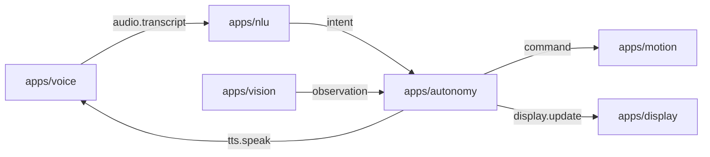

# Rider-Pi – Architektura projektu

## Opis ogólny
Rider-Pi to projekt robota opartego na Raspberry Pi. System składa się z modułowych usług (apps) komunikujących się przez prostą magistralę wiadomości (ZeroMQ – PUB/SUB). Celem jest interaktywny, autonomiczny asystent-robot z obsługą głosu, ruchu i percepcji.

---

## Struktura katalogów
```
/apps
  /voice      – rozpoznawanie mowy; publikacja transkryptu na busie
  /nlu        – analiza języka naturalnego; mapowanie na intencje/komendy
  /motion     – sterowanie napędem (L298N/PWM), serwami; awaryjny STOP
  /autonomy   – logika autonomii i stany zachowań; decyzje
  /vision     – przetwarzanie obrazu (kamera), obserwacje dla autonomy
  /ui         – UI, LCD face (xgoscreen), PID-lock, SPI takeover, Tk fallback
/common       – biblioteki wspólne (np. bus.py, utils, nlu_shared)
/scripts      – narzędzia (broker i testowe pub/sub)
/systemd      – pliki jednostek usług (autostart – później)
/assets       – dźwięki/grafiki/animacje (bez wrażliwych danych)
/models       – lokalne modele (opcjonalnie)
/data
  /logs       – logi działania (ignorowane w git)
  /recordings – nagrania audio (ignorowane w git)

robot_dev.sh  – skrypt startowy DEV (uruchamianie usług w kolejności)
README.md     – skrócona dokumentacja dla odwiedzających repo
PROJECT.md    – (ten plik) szczegóły architektury
```

---

## Architektura komunikacji (ZeroMQ)

Komponenty rozmawiają przez PUB/SUB. Każdy moduł publikuje/subskrybuje jasno zdefiniowane tematy.



### Tematy i minimalne ładunki (JSON)

| Topic              | Producent → Konsument             | Payload (minimal) |
|--------------------|-----------------------------------|-------------------|
| `audio.transcript` | voice → nlu/chat/*                 | `{"text":"jedź na przód","lang":"pl","ts":123,"source":"voice"}` |
| `tts.speak`        | chat/nlu → voice/ui               | `{"text":"Jadę do przodu","voice":"pl"}` |
| `motion.cmd`       | nlu/chat/autonomy → motion        | `{"type":"drive","dir":"forward","speed":0.6,"dur":1.0}` |
| `motion.state`     | motion → autonomy/ui/*            | `{"battery":0.82,"speed":0.0,"ts":123}` |
| `vision.event`     | vision → autonomy/*               | `{"type":"obstacle","dist_cm":23,"ts":123}` |
| `ui.face.set`      | nlu/chat/autonomy → ui            | `{"expr":"happy","intensity":0.7,"blink":true}` |
| `ui.face.config`   | * → ui                            | `{"lcd_spi_hz":48000000,"backend":"lcd"}` |
| `system.heartbeat` | każdy moduł → *                   | `{"app":"motion","pid":1234,"ver":"0.1.0","ts":123}` |

> Zasady:
> - Ładunki są **małe i spójne**; pola dodatkowe dozwolone, ale minimal powyżej.
> - Czas `ts` w sekundach (epoch). Język domyślny: `pl`.

## Wymagania i środowisko
- Raspberry Pi OS / Linux
- Python 3.9+
- Pakiety (przykład): `pyzmq`, `RPi.GPIO`/`gpiozero`, `pydantic` (opcjonalnie do walidacji), TTS/ASR wg potrzeb
- (Opcjonalnie) `venv`

## Zmienne środowiskowe (wspólne)

- Bus: `BUS_HOST=127.0.0.1`, `BUS_PUB=5555`, `BUS_SUB=5556`
- Locale: `LANG=pl`
- Logi: każdy moduł loguje do `data/logs/<mod>.log` (git-ignore)

### Kolejność startu (DEV)

1. `broker`  
2. `voice`  
3. `nlu` i/lub `chat`  
4. `motion`, `vision`  
5. `ui` (LCD face)
