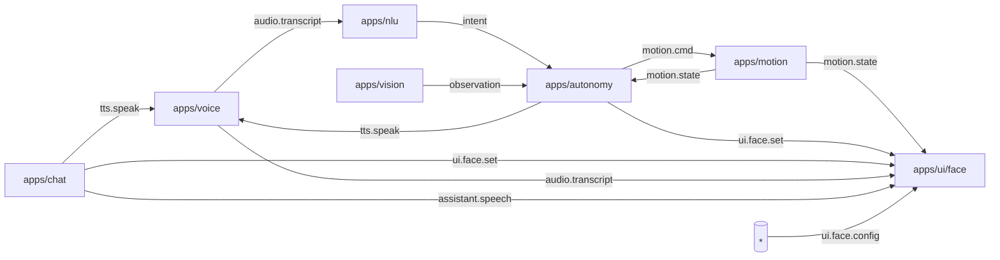

# Rider-Pi – Architektura projektu

## Opis ogólny

Rider-Pi to projekt robota opartego na Raspberry Pi. System składa się z modułowych usług (apps) komunikujących się przez prostą magistralę wiadomości (ZeroMQ – PUB/SUB). Celem jest interaktywny, autonomiczny asystent-robot z obsługą głosu, ruchu i percepcji.

**Stan na teraz (UI):** interfejs „buźki” został zrefaktoryzowany:

- `apps/ui/face.py` – logika aplikacji (BUS, model, pętla)
- `apps/ui/face_renderers.py` – renderery (LCD/Tk), brwi „tapered”, oversampling AA×2
- helper startowy w root: `./run_boot.sh` (takeover → broker → face; `--test` robi krótką sekwencję mimiki)

---

## Struktura katalogów

```
/apps
  /voice      – rozpoznawanie mowy; publikacja transkryptu na busie
  /nlu        – analiza języka naturalnego; mapowanie na intencje/komendy
  /motion     – sterowanie napędem (L298N/PWM), serwami; awaryjny STOP
  /autonomy   – logika autonomii i stany zachowań; decyzje
  /vision     – przetwarzanie obrazu (kamera), obserwacje dla autonomy
  /ui         – UI: face (LCD xgoscreen/Tk), PID-lock, SPI takeover, elipsa HEAD_KY
               • face.py            – app (BUS, model, pętla)
               • face_renderers.py  – rysowanie (LCD/Tk)
               • __init__.py
/common       – biblioteki wspólne (np. bus.py, utils)
/scripts      – narzędzia (broker i testowe pub/sub)
/systemd      – pliki jednostek usług (autostart – później)
/assets       – dźwięki/grafiki/animacje
/models       – lokalne modele (opcjonalnie)
/data
  /logs       – logi działania (ignorowane w git)
  /recordings – nagrania audio (ignorowane w git)

run_boot.sh   – szybki rozruch po restarcie (takeover → broker → face)
/robot_dev.sh – skrypt DEV (start/stop/status/all)
README.md     – skrót dla odwiedzających repo
PROJECT.md    – (ten plik) szczegóły architektury
```

---

## Architektura komunikacji (ZeroMQ)

Komponenty rozmawiają przez PUB/SUB. Każdy moduł publikuje/subskrybuje jasno zdefiniowane tematy.



### Tematy i minimalne ładunki (JSON)

| Topic              | Producent → Konsument      | Payload (minimal)                                                |
| ------------------ | -------------------------- | ---------------------------------------------------------------- |
| `audio.transcript` | voice → nlu/chat/\*        | `{"text":"jedź na przód","lang":"pl","ts":123,"source":"voice"}` |
| `tts.speak`        | chat/nlu → voice/ui        | `{"text":"Jadę do przodu","voice":"pl"}`                         |
| `motion.cmd`       | nlu/chat/autonomy → motion | `{"type":"drive","dir":"forward","speed":0.6,"dur":1.0}`         |
| `motion.state`     | motion → autonomy/ui/\*    | `{"battery":0.82,"speed":0.0,"ts":123}`                          |
| `vision.event`     | vision → autonomy/\*       | `{"type":"obstacle","dist_cm":23,"ts":123}`                      |
| `ui.face.set`      | nlu/chat/autonomy → ui     | `{"expr":"happy","intensity":0.7,"blink":true}`                  |
| `ui.face.config`   | \* → ui                    | `{"brow_style":"tapered","quality":"aa2x","brow_y_k":0.22}`      |
| `system.heartbeat` | ui/voice/motion/\* → \*    | `{"app":"ui.face","pid":1234,"ver":"0.3.0","fps":12.3, ...}`     |

**Subskrypcje UI (stan bieżący):**

- `ui.state`, `assistant.speech`, `audio.transcript` – sterują mrugnięciem/ustami/kolorem
- `ui.face.set` – ekspresje („happy/neutral/wake/process/low\_battery/speak”) + `intensity`, `blink`
- `ui.face.config` – runtime-konfiguracja wyglądu/trybu

``** – pola:**

- `expr`: `"neutral"|"happy"|"wake"|"record"|"process"|"speak"|"low_battery"`
- `intensity`: `0.0–1.0` (np. siła uśmiechu)
- `blink`: `true/false` (natychmiastowe mrugnięcie)

``** – pola (wybrane):**

- `brow_style`: `"classic"|"tapered"`
- `quality`: `"fast"|"aa2x"`
- `brow_taper`: `0.0–1.0` (zwężanie końcówek brwi)
- `brow_y_k`: `0.14–0.30` (pozycja brwi w górę/dół)
- `brow_h_k`: `0.06–0.16` (łuk/wygięcie brwi)
- `mouth_y_k`: `0.18–0.28` (pozycja ust)
- `head_ky`: `0.90–1.20` (elipsa głowy; `1.0` = koło)
- `lcd_spi_hz`: np. `48000000` (ustawiany „w locie”, jeśli sterownik na to pozwala)

---

## Wymagania i środowisko

- Raspberry Pi OS / Linux
- Python 3.9+
- Pakiety (przykład): `pyzmq`, `Pillow`, `xgoscreen` (LCD), `RPi.GPIO`/`gpiozero`
- (Opcjonalnie) `venv`

## Zmienne środowiskowe (wspólne)

- Bus: `BUS_HOST=127.0.0.1`, `BUS_PUB=5555`, `BUS_SUB=5556`
- Locale: `LANG=pl`
- Logi: każdy moduł loguje do `data/logs/<mod>.log` (git-ignore)

---

## UI (LCD Face) – uruchamianie (DEV)

**Szybki start po restarcie (polecane):**

```bash
cd ~/robot
chmod +x run_boot.sh
./run_boot.sh --test   # takeover → broker → face; + krótka sekwencja mimiki
```

**Ręcznie, krok po kroku:**

```bash
# 1) broker
python3 scripts/broker.py

# 2) face (LCD)
FACE_BACKEND=lcd FACE_GUIDE=1 python3 -m apps.ui.face

# 3) test BUS (inne okno)
python3 scripts/pub.py ui.face.set   '{"expr":"neutral"}'
python3 scripts/pub.py ui.face.set   '{"expr":"happy","intensity":1,"blink":true}'
python3 scripts/pub.py ui.face.config '{"brow_style":"tapered","quality":"aa2x","brow_y_k":0.22,"mouth_y_k":0.205,"head_ky":1.04}'
```

**DEV kontroler (wielomodułowy):**

```bash
# UI (wykonuje też takeover)
./robot_dev.sh face

# inne:
./robot_dev.sh broker | stop | status | all | takeover
```

**ENV (przydatne):**

- `FACE_BACKEND`: `lcd|tk` (domyślnie `lcd`)
- `FACE_GUIDE`: `1/0` – elipsa przewodnik
- `FACE_HEAD_KY`: `0.90–1.20` – skala pionu elipsy (1.00=koło; >1=owal)
- `FACE_BENCH`: `1/0` – FPS/draw/push na STDOUT
- `FACE_LCD_ROTATE`: `0/90/180/270` (typowo `270` dla Rider-Pi)
- `FACE_BROW_STYLE`: `classic|tapered`
- `FACE_QUALITY`: `fast|aa2x` (AA×2 = lepsze krawędzie kosztem FPS)

---

## Kolejność startu (DEV)

1. `broker`
2. `voice`
3. `nlu` i/lub `chat`
4. `motion`, `vision`
5. `ui` (LCD face)

> Nie przechodzimy jeszcze na systemd/usługi – start/stop robi `run_boot.sh` lub `robot_dev.sh`.\
> Jeśli domyślna aplikacja systemowa (root) blokuje ekran/SPI, używamy **takeover** (wbudowany w `run_boot.sh` oraz `robot_dev.sh face`).

---

## Notatki z ostatniego sprintu (UI)

- Refaktor buźki na **app + renderery**; import jako moduł: `python3 -m apps.ui.face`.
- Obwiednia głowy jako **elipsa** sterowana `HEAD_KY`; brwi „tapered” (poligon, opcjonalny AA×2).
- Parametry mimiki (usta/brwi) skalowane względem wymiaru kanwy — spójnie LCD/Tk.
- Dodane runtime-`ui.face.config` (pozycja brwi/ust, styl brwi, jakość, SPI Hz).
- Helper `run_boot.sh` w root do „jednostrzałowego” startu po restarcie.

