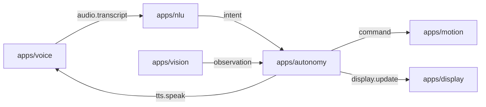

# Rider-Pi – Architektura projektu

## Opis ogólny

Rider-Pi to projekt robota opartego na Raspberry Pi. System składa się z modułowych usług (apps) komunikujących się przez prostą magistralę wiadomości (ZeroMQ – PUB/SUB). Celem jest interaktywny, autonomiczny asystent-robot z obsługą głosu, ruchu i percepcji.

---

## Struktura katalogów

```
/apps
  /voice      – rozpoznawanie mowy; publikacja transkryptu na busie
  /nlu        – analiza języka naturalnego; mapowanie na intencje/komendy
  /motion     – sterowanie napędem (L298N/PWM), serwami; awaryjny STOP
  /autonomy   – logika autonomii i stany zachowań; decyzje
  /vision     – przetwarzanie obrazu (kamera), obserwacje dla autonomy
  /ui         – UI, LCD face (xgoscreen/Tk), PID-lock, SPI takeover, elipsa HEAD_KY
/common       – biblioteki wspólne (np. bus.py, utils, nlu_shared)
/scripts      – narzędzia (broker i testowe pub/sub)
/systemd      – pliki jednostek usług (autostart – później)
/assets       – dźwięki/grafiki/animacje (bez wrażliwych danych)
/models       – lokalne modele (opcjonalnie)
/data
  /logs       – logi działania (ignorowane w git)
  /recordings – nagrania audio (ignorowane w git)

robot_dev.sh  – skrypt startowy DEV (uruchamianie usług w kolejności)
README.md     – skrócona dokumentacja dla odwiedzających repo
PROJECT.md    – (ten plik) szczegóły architektury
```

---

## Architektura komunikacji (ZeroMQ)

Komponenty rozmawiają przez PUB/SUB. Każdy moduł publikuje/subskrybuje jasno zdefiniowane tematy.



### Tematy i minimalne ładunki (JSON)

| Topic              | Producent → Konsument      | Payload (minimal)                                                |
| ------------------ | -------------------------- | ---------------------------------------------------------------- |
| `audio.transcript` | voice → nlu/chat/\*        | `{"text":"jedź na przód","lang":"pl","ts":123,"source":"voice"}` |
| `tts.speak`        | chat/nlu → voice/ui        | `{"text":"Jadę do przodu","voice":"pl"}`                         |
| `motion.cmd`       | nlu/chat/autonomy → motion | `{"type":"drive","dir":"forward","speed":0.6,"dur":1.0}`         |
| `motion.state`     | motion → autonomy/ui/\*    | `{"battery":0.82,"speed":0.0,"ts":123}`                          |
| `vision.event`     | vision → autonomy/\*       | `{"type":"obstacle","dist_cm":23,"ts":123}`                      |
| `ui.face.set`      | nlu/chat/autonomy → ui     | `{"expr":"happy","intensity":0.7,"blink":true}`                  |
| `ui.face.config`   | \* → ui                    | `{"lcd_spi_hz":48000000,"backend":"lcd"}`                        |

> Uwaga (stan bieżący UI): renderer `apps/ui/face.py` **subskrybuje** m.in. `ui.state`, `assistant.speech`, `audio.transcript` (wejścia do animacji, mrugnięcia i ruchu ust). Powyższa tabela definiuje docelowy model – zgodny z resztą systemu.

---

## Wymagania i środowisko

- Raspberry Pi OS / Linux
- Python 3.9+
- Pakiety (przykład): `pyzmq`, `RPi.GPIO`/`gpiozero`, TTS/ASR wg potrzeb
- (Opcjonalnie) `venv`

## Zmienne środowiskowe (wspólne)

- Bus: `BUS_HOST=127.0.0.1`, `BUS_PUB=5555`, `BUS_SUB=5556`
- Locale: `LANG=pl`
- Logi: każdy moduł loguje do `data/logs/<mod>.log` (git-ignore)

---

## UI (LCD Face) – uruchamianie (DEV)

- Plik: `apps/ui/face.py` (dawne `face2.py`). Działa na LCD (SPI) i ma fallback Tk.
- DEV kontroler: `./robot_dev.sh face`\
  – skrypt **robi takeover** (zamyka domyślną appkę startową i zwalnia SPI).\
  – jeśli autostartowa appka działa jako root i blokuje wyświetlacz, można też użyć `./robot_dev.sh takeover` przed startem UI.

**ENV dla UI:**

- `FACE_BACKEND`: `lcd` | `tk` (domyślnie `lcd`)
- `FACE_GUIDE`: `1/0` – rysuje przewodnik (elipsę twarzy)
- `FACE_HEAD_KY`: `0.90–1.20` – skala pionu elipsy (1.00 = koło; >1.0 owal; <1.0 „pełniejsza”)
- `FACE_BENCH`: `1/0` – benchmark na STDOUT (FPS/draw/push)
- (opc.) `FACE_LCD_ROTATE`: `0/90/180/270` (domyślnie 270)

**Przykład (DEV):**

```bash
FACE_BACKEND=lcd FACE_GUIDE=1 FACE_HEAD_KY=1.12 ./robot_dev.sh face
```

---

## Kolejność startu (DEV)

1. `broker`
2. `voice`
3. `nlu` i/lub `chat`
4. `motion`, `vision`
5. `ui` (LCD face)

> Uwaga: nie przechodzimy jeszcze na systemd/usługi – start/stop robi `robot_dev.sh`. W wersji DEV, jeśli domyślna aplikacja systemowa blokuje ekran, `robot_dev.sh face` wykonuje takeover przed startem UI.
