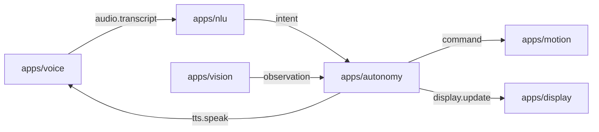

# Rider-Pi – Architektura projektu

## Opis ogólny
Rider-Pi to projekt robota opartego na Raspberry Pi. System składa się z modułowych usług (apps) komunikujących się przez prostą magistralę wiadomości (ZeroMQ – PUB/SUB). Celem jest interaktywny, autonomiczny asystent-robot z obsługą głosu, ruchu i percepcji.

---

## Struktura katalogów
```
/apps
  /voice      – rozpoznawanie mowy; publikacja transkryptu na busie
  /nlu        – analiza języka naturalnego; mapowanie na intencje/komendy
  /motion     – sterowanie napędem (L298N/PWM), serwami; awaryjny STOP
  /autonomy   – logika autonomii i stany zachowań; decyzje
  /vision     – przetwarzanie obrazu (kamera), obserwacje dla autonomy
  /ui         – UI, LCD face (xgoscreen), PID-lock, SPI takeover, Tk fallback
/common       – biblioteki wspólne (np. bus.py, utils, nlu_shared)
/scripts      – narzędzia (broker i testowe pub/sub)
/systemd      – pliki jednostek usług (autostart – później)
/assets       – dźwięki/grafiki/animacje (bez wrażliwych danych)
/models       – lokalne modele (opcjonalnie)
/data
  /logs       – logi działania (ignorowane w git)
  /recordings – nagrania audio (ignorowane w git)

robot_dev.sh  – skrypt startowy DEV (uruchamianie usług w kolejności)
README.md     – skrócona dokumentacja dla odwiedzających repo
PROJECT.md    – (ten plik) szczegóły architektury
```

---

## Architektura komunikacji (ZeroMQ)

Komponenty rozmawiają przez PUB/SUB. Każdy moduł publikuje/subskrybuje jasno zdefiniowane tematy.



### Tematy (topics) – kontrakty i przykłady

**`audio.transcript`** (Voice → NLU)
```json
{
  "text": "jedz na przód",
  "lang": "pl",
  "ts": 123,
  "source": "mic|test"
}
```

**`intent`** (NLU → Autonomy)
```json
{
  "name": "MOVE_FORWARD",
  "slots": {"speed": 0.6, "duration": 1.2},
  "ts": 124
}
```

**`command`** (Autonomy → Motion)
```json
{
  "type": "drive",
  "left": 0.6,
  "right": 0.6,
  "timeout": 1200
}
```

**`tts.speak`** (Autonomy/Chat → Voice)
```json
{ "text": "Jadę do przodu", "lang": "pl" }
```

**`display.update`** (Autonomy → Display)
```json
{ "screen": "status", "state": "moving", "battery": 0.72 }
```

> **Uwaga:** Tematy i ładunki (payload) trzymaj minimalne i spójne. Dodawaj wersjonowanie, jeśli zmieniasz strukturę (np. `"schema":"v1"`).

---

## Wymagania i środowisko
- Raspberry Pi OS / Linux
- Python 3.9+
- Pakiety (przykład): `pyzmq`, `RPi.GPIO`/`gpiozero`, `pydantic` (opcjonalnie do walidacji), TTS/ASR wg potrzeb
- (Opcjonalnie) `venv`

### Konfiguracja `.env` (zalecana)
Utwórz `.env` (ignorowany w git) i wypełnij np.:
```
# Bus (ZeroMQ)
BUS_PUB_PORT=5555
BUS_SUB_PORT=5556

# Voice / język
VOICE_STANDALONE=0
DEFAULT_LANG=pl

# Hotword
HOTWORD=lulu
```
Możesz dodać plik **`.env.example`** do repo jako szablon (bez sekretów).

---

## Uruchamianie (DEV)
```bash
git clone https://github.com/pppnews/Rider-Pi.git
cd Rider-Pi
# (opcjonalnie) python -m venv .venv && source .venv/bin/activate && pip install -r requirements.txt
chmod +x robot_dev.sh
./robot_dev.sh
```

> `robot_dev.sh` przed startem zabija stare instancje usług, a następnie podnosi broker/bus i kolejne moduły. W logach preferujemy konsolę (bez systemd na etapie DEV).

---

## Bezpieczeństwo i tryb SAFE
Aby uniknąć niebezpiecznych ruchów (np. po podniesieniu robota):
- Na starcie i przy SIGINT/SIGTERM wywołuj `motors_safe_off()` (zerowanie PWM/INx); rejestruj `atexit`.
- Rozważ **exclusive lock** (gdyby program uruchomił się podwójnie).
- W `autonomy/motion` dodaj logikę: brak podłoża (np. czujnik VL53L0X/ultra w dół) ⇒ `SAFE_MODE=ON`, `stop_all_motors()`.
- Komenda awaryjna „STOP/Stój” (IR/voice/topic `control.stop`) natychmiast zatrzymuje napęd.

---

## Standard pracy (Git)
- `main` – stabilny branch
- `dev` – prace bieżące; PR do `main`
- Commity: krótkie, w trybie rozkazującym (np. `Add safety lock for motion`)
- `.gitignore` zawiera logi, nagrania, modele itp. (nie commituj sekretów). Używaj `.env`.

---

## Plan rozwoju (TODO)
- [ ] Moduł `common/safety.py` (SIG-handlers, atexit, ground-detect, STOP)
- [ ] Tabela wszystkich topics + schematy w `docs/` (lub sekcja poniżej)
- [ ] Integracja VL53L0X (detekcja podłoża) i IMU (wstrząsy/podniesienie)
- [ ] Rozszerzenie autonomy: tryby patrol/obiekt-follow
- [ ] Integracja z `systemd` (autostart usług produkcyjnie)
- [ ] GitHub Actions: lint/test (opcjonalnie)

---

## Licencja
TBD (np. MIT). Jeśli nie chcesz pełnego open-source, pozostaw repo bez licencji (domyślnie „all rights reserved”).

